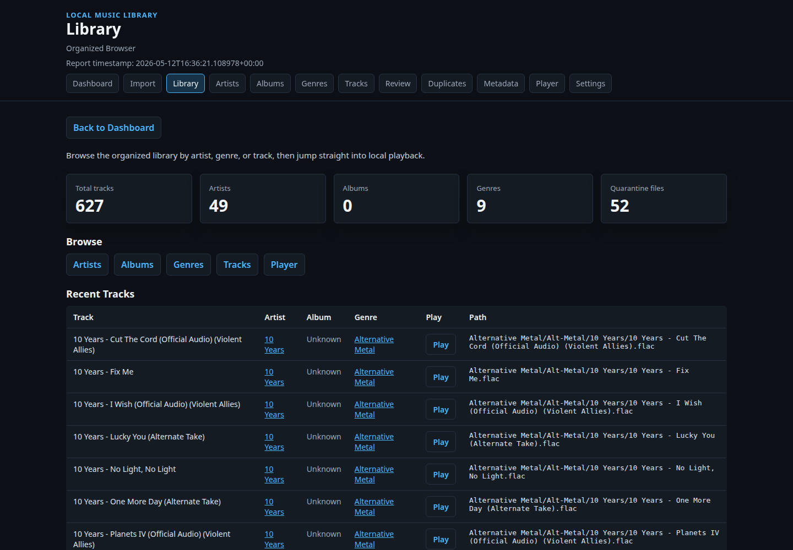
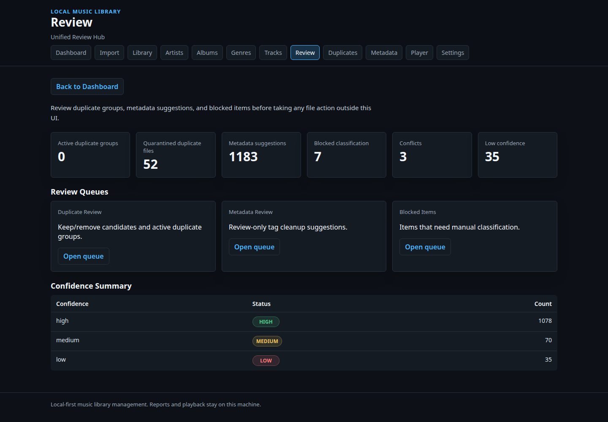
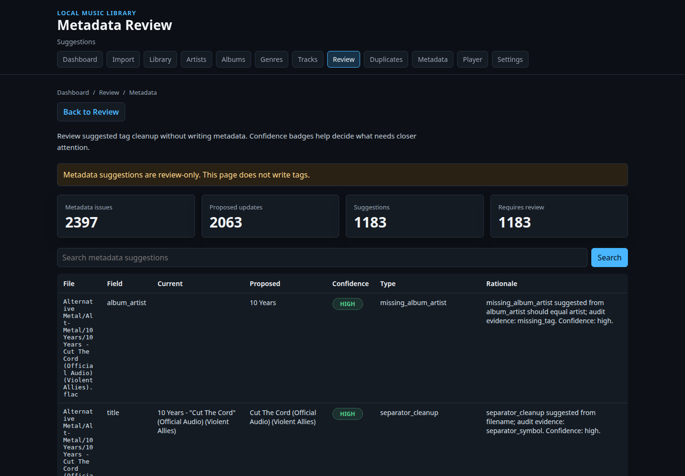
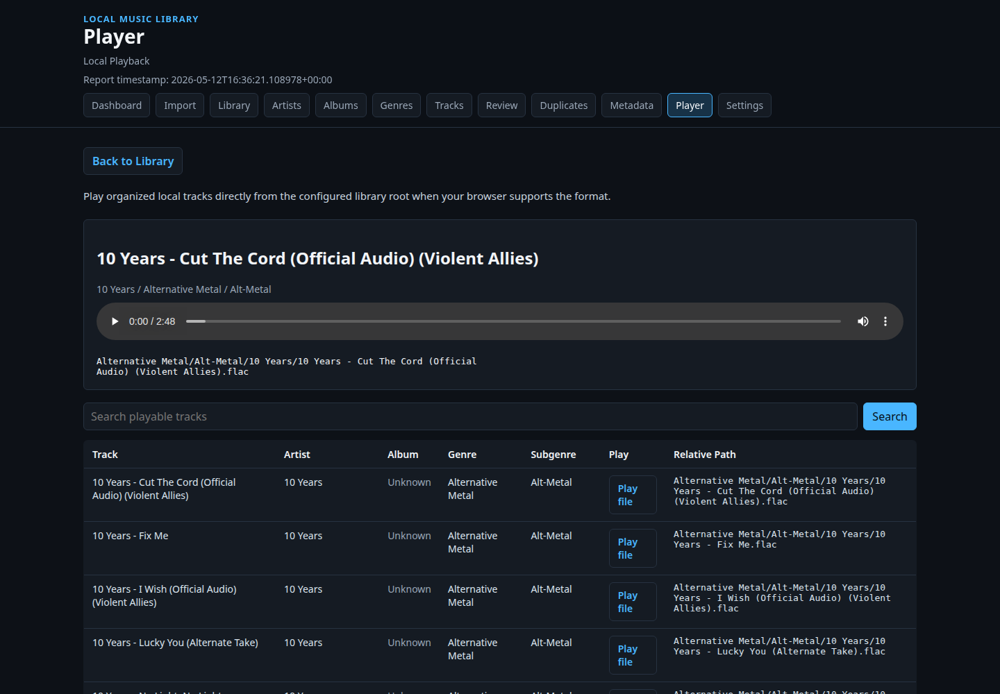

# Local Music Library

A local-first music library management application powered by deterministic
audit and remediation workflows.

Local Music Library helps organize, review, browse, and play a messy local music
collection around Artists -> Albums -> Tracks without cloud services, accounts,
streaming integrations, or destructive automation. It observes files, records
evidence, plans changes, exposes review checkpoints, quarantines known duplicate
candidates, and restores from an audit trail. The project is built around
deterministic rules and local SQLite state.

## 1. Overview

This repository contains a Python application and server-rendered Jinja2 UI for
maintaining a FLAC-focused local music library. The primary workflow is:

```text
Import messy music
  -> analyze library
  -> review issues
  -> review duplicates
  -> review metadata suggestions
  -> browse organized artists, albums, and tracks
  -> play tracks locally
```

The command-line pipeline still performs the deterministic scanning, planning,
QA, duplicate, metadata, quarantine, and restore work. The UI consolidates those
outputs into one coherent local music library application.

The system favors explicit stages: observation, planning, review, execution,
quarantine, and restore. Most commands inspect data and write reports or ledger
records. Commands that can change files are narrow, support dry-run review where
appropriate, and preserve recovery information.

## Documentation

- [Architecture](docs/architecture.md)
- [Operational workflow](docs/operational-workflow.md)
- [AI-assisted workflow](docs/ai-assisted-workflow.md)
- [Demo workflow](docs/demo-workflow.md)
- [Demo script](docs/demo-script.md)
- [Normalization rules](docs/normalization-rules.md)
- [Evidence reliability](docs/evidence-reliability.md)
- [Canonical entity graph](docs/canonical-entity-graph.md)
- [Canonical entity classification](docs/canonical-entity-classification.md)
- [Entity roles](docs/entity-roles.md)
- [Sample outputs](docs/sample-outputs/)

## 2. Problem Statement

Personal media libraries often grow through years of inconsistent naming,
partial tags, repeated files, manual folder changes, and uncertain cleanup
history. Once a library reaches hundreds or thousands of files, direct manual
maintenance becomes risky because mistakes can overwrite curated files, remove
the wrong copy, or leave no clear record of what changed.

This project addresses that operational problem by separating observation,
planning, execution, audit, quarantine, and restore into inspectable steps with
evidence preserved at each review boundary.

## 3. What the System Does

- Scans local audio files and records observations in SQLite.
- Resolves probable track identity from tags, filenames, parent folders, and
  controlled artist seed data.
- Infers album groupings from FLAC album tags, album-like parent folders,
  filename/title evidence, or the explicit `Unknown Album` fallback.
- Adds an Album Cohesion Engine that scores album groupings from repeated
  agreement across tags, track numbers, years, folders, filenames, co-occurrence,
  placement structure, and normalization knowledge evidence when present.
- Adds an Evidence Reliability Engine that scores metadata evidence before
  album cohesion and metadata suggestions rely on it.
- Adds a Canonical Entity Type Classifier that blocks track titles, source
  artifacts, uploader channels, and ambiguous strings before graph promotion.
- Adds a Canonical Entity Graph that persists canonical artists, albums, tracks,
  versions, and evidence-governed relationships without auto-merging conflicts.
- Classifies files using deterministic artist and genre rules.
- Plans album-aware organized placement paths before copying files.
- Generates library QA, duplicate, metadata audit, metadata normalization, and
  metadata suggestion reports for review-based remediation.
- Detects likely album conflicts, probable singles, compilation mixes, and
  orphan tracks without auto-assigning album tags.
- Produces duplicate review plans and quarantines selected remove candidates.
- Restores quarantined files from recorded ledger information.
- Serves a read-only FastAPI/Jinja2 local music library UI over generated
  reports, with album-aware browsing from existing album folders, generated
  album organization plans, or fallback grouping when tracks have no album
  folder yet.
- Plays organized local tracks through an HTML5 audio player when the browser
  supports the file format.

The project does not claim AI recognition, audio fingerprinting, automatic tag
writing, or unsupervised destructive cleanup.

## 4. Architecture Flow

```text
Local media files
  |
  v
Scanner
  - records file paths, hashes, tags, and probe results
  |
  v
SQLite observation ledger
  |
  +--> Identity engine
  |      - probable artist, title, album, year, and mix
  |      - conflict and unknown states retained for review
  |
  +--> Classification engine
  |      - controlled artist seed rules
  |      - embedded genre metadata fallback
  |
  v
Placement planner
  - creates reviewable Genre / Artist / Album / Track destination paths
  - writes plans before file movement
  |
  v
Placement executor
  - copies planned files into an organized library root
  - avoids overwriting existing destinations
  |
  v
QA, duplicate, metadata audit, and metadata plan reports
  |
  v
Metadata suggestions
  - review-only cleanup suggestions from audit and plan evidence
  - optional rationale wording enrichment when configured
  |
  v
Review decision ledger
  - approved, rejected, and deferred human decisions
  - audit trail for future reusable normalization rules
  |
  v
Normalization knowledge engine
  - reusable evidence from approved and rejected decisions
  - improves future suggestion confidence without auto-approval
  |
  v
Evidence reliability engine
  - detects uploader/channel artifacts, platform remnants, noisy imports, and
    canonical agreement
  - down-ranks unreliable evidence for album cohesion and suggestions
  |
  v
Duplicate review
  - keep, remove-candidate, and manual-review outcomes
  |
  v
Quarantine and restore
  - ledger-backed movement and recovery
  |
  v
Local music library app UI
```

## 5. Current Evidence / Metrics

Current generated evidence shows:

- 627 organised FLAC files
- 52 quarantined duplicates
- 0 active duplicate groups
- 0 unresolved missing files
- 627 readable FLAC files in metadata audit
- 2063 proposed metadata updates
- 238 passing tests

Evidence is represented in generated report artifacts under:

- `reports/library_qa/`
- `reports/duplicates_scan_1/`
- `reports/metadata_audit/`
- `reports/metadata_plan/`

## 6. Core Capabilities

- Local SQLite observation ledger for repeatable file processing.
- Audio scanning for common local media formats, with `ffprobe` results recorded
  when available.
- Identity resolution from available local evidence without remote lookups.
- Deterministic genre and subgenre classification from local rules.
- Placement planning and copy execution for organized library output.
- Plan-first album organization for existing libraries; the
  `plan-album-organization` command writes CSV/JSON reports and never moves
  files.
- Library QA summaries for organized files, quarantine state, missing files, and
  duplicate status.
- Duplicate report generation for exact hashes, same artist/title groups, and
  probable variants.
- Duplicate review planning with explicit keep, remove-candidate, and manual
  review outcomes.
- Quarantine movement for selected duplicate remove candidates.
- Restore workflow based on recorded quarantine items.
- FLAC metadata audit and proposed normalization plan generation.
- Review-only metadata cleanup suggestions generated from audit and plan
  evidence.
- Review-only album metadata discovery for tracks currently missing album tags
  or grouped as `Unknown Album`.
- Unified read-only web UI for import workflow, dashboard, library browsing,
  review queues, local playback, and settings.

## Operational Characteristics

- Deterministic workflows based on local files, local rules, and SQLite records.
- Dry-run support for quarantine and restore review.
- Quarantine instead of deletion for duplicate remediation.
- Restore capability backed by recorded quarantine ledger entries.
- Human approval boundaries between report generation, planning, and execution.
- Audit-first workflow for duplicate, metadata, QA, and remediation decisions.
- Review checkpoints before file movement or recovery operations.

## Review Decision Ledger

Review decisions are persisted as an audit ledger for metadata suggestions.
Approved, rejected, and deferred decisions do not write tags, move files, or
approve future actions automatically. The ledger will later feed reusable
normalization rules for artist casing, title cleanup, album artist handling, and
rejected cleanup patterns.

## Normalization Knowledge Engine

The normalization knowledge engine derives reusable rules from the review
decision ledger. Approved decisions become future evidence for matching metadata
suggestions, and rejected decisions are retained as rejected patterns. Knowledge
can improve suggestion confidence and rationale, but it never writes metadata
tags, moves files, deletes files, or auto-approves suggestions.

## 7. CLI Workflow

Initialize the local ledger:

```bash
python -m app.main init-db
```

Scan, identify, classify, and plan placement:

```bash
python -m app.main scan --source ~/Music/Library_Intake
python -m app.main identify --scan-run-id 1
python -m app.main classify --scan-run-id 1
python -m app.main plan-placement --scan-run-id 1
```

Generate core review and QA reports:

Core command forms:

```bash
python -m app.main library-qa ...
python -m app.main metadata-audit ...
python -m app.main metadata-plan ...
python -m app.main metadata-suggestions ...
python -m app.main review-decision ...
python -m app.main import-review-decisions ...
python -m app.main review-decision-report --out reports
python -m app.main build-normalization-knowledge --out reports
python -m app.main album-cohesion --out reports
python -m app.main evidence-reliability --out reports
python -m app.main canonical-graph --out reports
python -m app.main discover-albums ...
python -m app.main duplicate-report ...
python -m app.main duplicate-review ...
python -m app.main quarantine-duplicates --dry-run
python -m app.main restore-quarantine --dry-run
```

Example report commands:

```bash
python -m app.main review-report --scan-run-id 1 --out reports
python -m app.main library-qa \
  --library-root ~/Music/Organised_Library \
  --quarantine-root ~/Music/Quarantine_Duplicates \
  --out reports
python -m app.main metadata-audit \
  --library-root ~/Music/Organised_Library \
  --out reports
python -m app.main metadata-plan \
  --library-root ~/Music/Organised_Library \
  --out reports
python -m app.main metadata-suggestions \
  --metadata-plan reports/metadata_plan/metadata_plan.csv \
  --metadata-audit reports/metadata_audit \
  --out reports
python -m app.main review-decision \
  --suggestion-key <key> \
  --decision approved \
  --reason "confirmed by review"
python -m app.main import-review-decisions \
  --suggestions reports/metadata_suggestions/metadata_suggestions.csv \
  --decisions decisions.csv
python -m app.main review-decision-report --out reports
python -m app.main build-normalization-knowledge --out reports
python -m app.main album-cohesion --out reports
python -m app.main evidence-reliability --out reports
python -m app.main canonical-graph --out reports
python -m app.main plan-album-organization \
  --library-root ~/Music/Organised_Library \
  --out reports
python -m app.main discover-albums \
  --library-root ~/Music/Organised_Library \
  --out reports
python -m app.main duplicate-report \
  --scan-run-id 1 \
  --library-root ~/Music/Organised_Library \
  --out reports
python -m app.main duplicate-review --duplicate-report-id 1 --out reports
```

Bulk decision imports can identify suggestions by `suggestion_key` or by the visible suggestion fields: `file_path`, `field`, `current_value`, `proposed_value`, and optionally `suggestion_type`.

Album-aware organization is plan-first. The generated report lives under
`reports/album_organization_plan/` and proposes paths in this shape:

```text
Genre/
  Artist/
    Album/
      Artist - Track.flac
```

`plan-album-organization` does not move, delete, copy, or write metadata tags.
It exists to make album folders reviewable before any future migration step, and
to prepare the UI for proper artist -> album -> track browsing.

Album Cohesion Engine reports are also review-only. The `album-cohesion`
command looks for repeated evidence agreement instead of trusting one field:
album tags, sequential track numbers, shared years, repeated source folders,
filename patterns, track co-occurrence, directory structure, placement
structure, and normalization knowledge references in metadata suggestions when
available. It writes reports under `reports/album_cohesion/`:

```text
album_cohesion_summary.json
album_groups.json
album_groups.csv
album_conflicts.csv
orphan_tracks.csv
```

The report includes `cohesion_score`, `high` / `medium` / `low` confidence
tiers, rationale snippets, probable singles, probable compilation mixes,
conflicting album assignments, and orphan tracks. It does not write metadata
tags, move files, create album folders, or auto-approve assignments.

Evidence Reliability Engine reports are review-only. The
`evidence-reliability` command scores metadata evidence quality from existing
metadata suggestions, album cohesion output, normalization knowledge, and review
decisions. It writes reports under `reports/evidence_reliability/`:

```text
evidence_reliability_summary.json
unreliable_evidence.csv
reliable_patterns.csv
reliability_groups.json
```

Reliability records include a `reliability_score` from 0.0 to 1.0, a `high` /
`medium` / `low` tier, flags, and rationale snippets. The engine detects
uploader/channel signatures, official media suffixes, remaster noise, platform
branding, noisy autogenerated names, casing anomalies, excessive separators,
artist/folder mismatches, and repeated non-musical tokens. It raises reliability
when repeated canonical agreement, normalization knowledge, album cohesion,
sequential tracks, folder consistency, prior approvals, or low conflict rates
support the value. It never mutates media files or removes metadata.

Canonical Entity Classification reports are review-only. The
`classify-canonical-entities` command classifies candidate artist, album, and
track strings before the graph can promote them:

```text
reports/canonical_entity_classification/
  entity_classification_summary.json
  entity_classifications.csv
  blocked_entity_candidates.csv
  ambiguous_entity_candidates.csv
```

The classifier flags track titles misfiled as artists, uploader/channel
artifacts, source or label residue, version descriptors, valid canonical
candidates, and unresolved ambiguity. The canonical graph uses the same
deterministic classifications to keep blocked artist and album candidates out
of active canonical entities while retaining the rationale as unresolved
conflict evidence. It never mutates media files or writes metadata.

Entity Role reports are review-only. The `entity-roles` command separates
`entity_value` from `entity_value + entity_role + context`, so legitimate
multi-role values such as artist names that also appear as album titles are not
blocked globally:

```text
reports/entity_roles/
  entity_role_summary.json
  entity_roles.csv
  multi_role_entities.csv
  conflicted_roles.csv
  blocked_role_collisions.csv
```

The classifier and canonical graph use role context to preserve valid
multi-role artists, albums, and tracks while keeping source-artifact and
uploader-artifact blocking role-specific. It never mutates media files or
writes metadata.

Canonical Entity Graph reports are review-only and persistent. The
`canonical-graph` command rebuilds canonical artists, albums, tracks, versions,
and relationships from accumulated local evidence, then writes:

```text
reports/canonical_graph/
  canonical_artists.csv
  canonical_albums.csv
  canonical_tracks.csv
  canonical_versions.csv
  entity_relationships.csv
  unresolved_conflicts.csv
  graph_summary.json
```

The graph supports `alias_of`, `belongs_to_album`, `probable_duplicate`,
`probable_live_version`, `probable_remaster`, `probable_single`,
`probable_compilation_member`, and `probable_same_track` relationships. It
records unresolved ambiguity instead of silently collapsing conflicting
entities, and it never writes tags, moves files, deletes files, calls external
APIs, or uses embeddings.

Album metadata discovery is also review-only. The `discover-albums` command
looks at existing tags, filenames, and local path evidence for tracks with
missing or `Unknown Album` album values, then writes suggestions under
`reports/album_discovery/`:

```text
album_discovery_summary.json
album_discovery_suggestions.csv
album_discovery_suggestions.json
cache/
```

Network metadata lookup is opt-in with `--use-network`. When enabled, lookup
responses are cached under `reports/album_discovery/cache/` so repeated runs are
stable. Without `--use-network`, the command still runs using deterministic
local evidence only. It does not write tags, move files, rename files, or
auto-approve album matches. Every suggestion is marked as requiring human
review, and suggestions must be reviewed before any future execution workflow.

Run duplicate quarantine and restore in dry-run mode:

```bash
python -m app.main quarantine-duplicates --dry-run
python -m app.main restore-quarantine --dry-run
```

Use a separate SQLite database:

```bash
python -m app.main --db /tmp/media_library.sqlite3 scan --source ~/Music/Library_Intake
```

## 8. Local Music Library UI

The UI is a read-only FastAPI/Jinja2 local application over generated pipeline
reports. It does not mutate media files, apply duplicate decisions, write
metadata, authenticate users, call remote APIs, or integrate streaming services.

Run the UI:

```bash
uvicorn app.main:app --reload
```

Available routes include:

```text
/
/import
/library
/library/artists
/library/albums
/library/albums/{album_key}
/library/genres
/library/tracks
/review
/review/duplicates
/review/metadata
/review/canonical-graph
/review/entity-classification
/review/entity-roles
/review/reliability
/player
/settings
```

Legacy report/review URLs remain available for compatibility, including
`/reports`, `/reports/duplicates`, `/review/quarantine`, `/review/conflicts`,
`/review/blocked`, and `/review/metadata-suggestions`.

The metadata review pages show proposed values, confidence, rationale, and
source evidence without writing tags or modifying media files. Metadata
suggestions can be approved, rejected, or deferred from the UI. These decisions
update the review ledger and can later be converted into reusable normalization
knowledge with `python -m app.main build-normalization-knowledge --out reports`.

Local playback is supported for organized library files. Audio is served through
`/media/audio?path=<relative_library_path>`, and the server restricts playback
to files that resolve inside the configured library root.

Set `MUSIC_LIBRARY_REPORTS_DIR` before startup to read reports from a directory
other than `reports`.

## UI Screenshot Capture

Install the Python dependencies, then install the Playwright Chromium browser:

```bash
python -m pip install -r requirements.txt
playwright install chromium
```

With the local UI already running at `http://127.0.0.1:8000`, capture
deterministic portfolio screenshots:

```bash
python -m app.main capture-ui-screenshots
```

Screenshots are written to `docs/screenshots/` using stable filenames for the
dashboard, library browser, unified review hub, metadata review, and player
views. The command prints `captured=<count>`,
`failed=<count>`, and each generated file path; individual route failures are
reported without stopping remaining captures.

## Demo Generation

Generate deterministic local demo artifacts from UI screenshots and read-only
CLI evidence frames:

```bash
python -m app.main generate-demo
```

Dependencies: Python requirements, Playwright Chromium for UI screenshots, and
optional `ffmpeg` for MP4 stitching. Outputs are written under `demo/`:
`demo/frames/`, `demo/demo_script.md`, `demo/demo_manifest.json`, and
`demo/demo.mp4` when `ffmpeg` is installed. This workflow does not perform live
screen recording, voice synthesis, AI narration, schema changes, or media-file
mutation. Demo assets are regenerated from current report and review workflows
each run.

## Sample Outputs

Sanitized excerpts from generated reports are available under
[docs/sample-outputs/](docs/sample-outputs/):

- [Metadata summary](docs/sample-outputs/sample_metadata_summary.json)
- [Duplicate summary](docs/sample-outputs/sample_duplicate_summary.json)
- [Library QA summary](docs/sample-outputs/sample_library_qa_summary.json)
- [Metadata plan excerpt](docs/sample-outputs/sample_metadata_plan_excerpt.csv)
- [Duplicate review excerpt](docs/sample-outputs/sample_duplicate_review_excerpt.csv)

## Demo Workflow

Use [docs/demo-workflow.md](docs/demo-workflow.md) for the reproducible CLI
walkthrough and [docs/demo-script.md](docs/demo-script.md) for a concise
60-90 second recording script.

## 9. Metadata Audit + Normalization Plan

The metadata audit inspects FLAC files with `mutagen` and reports tag quality
issues without writing changes. The normalization plan proposes updates inferred
from organized library paths and observed metadata.

Current metadata evidence:

- 627 readable FLAC files in metadata audit
- 2063 proposed metadata updates

The plan is intentionally review-oriented. It documents candidate updates; it
does not save tags to media files.

## 10. Duplicate Detection + Quarantine Safety

Duplicate handling is staged:

- `duplicate-report` exports duplicate candidates without changing files.
- `duplicate-review` converts duplicate evidence into reviewable decisions.
- `quarantine-duplicates` moves only rows marked as remove candidates.
- Dry-run mode is available before quarantine execution.

Current duplicate evidence:

- 0 active duplicate groups
- 52 quarantined duplicates

The system distinguishes live duplicate state from historical quarantine state,
so previously quarantined files do not appear as active unresolved duplicate
groups.

## 11. Restore / Recovery Model

Quarantine and restore operations are ledger-backed. The database records source
paths, quarantine paths, run IDs, per-file outcomes, and restore attempts.

Restore uses recorded quarantine items instead of guessing from the filesystem.
It supports dry-run mode and avoids overwriting existing restore targets.

## 12. Testing

The test suite covers scanner behavior, identity resolution, classification,
intake, placement planning and execution, reporting, duplicate review,
quarantine, restore, metadata audit, metadata planning, and report UI behavior.

Run tests:

```bash
python -m pytest -q
```

Current result:

```text
271 passed
```

## 13. Repository Structure

```text
app/
  main.py                 CLI entry point and local UI app
  scanner.py              Local media observation
  identity_engine.py      Deterministic identity resolution
  classifier.py           Classification rules
  placement.py            Placement planning and execution
  duplicate_*.py          Duplicate reporting, review, quarantine, restore
  album_cohesion.py       Repeated-evidence album grouping reports
  metadata_*.py           FLAC audit and normalization planning
  library_app_ui.py       Unified local music library UI routes
  report_*.py             Report generation and compatibility UI helpers

reports/
  library_qa/             Library health reports
  duplicates_scan_1/      Duplicate report outputs
  metadata_audit/         Metadata audit outputs
  metadata_plan/          Metadata normalization plan outputs
  album_cohesion/         Album cohesion grouping and conflict reports

tests/
  test_*.py               Focused pytest coverage for pipeline behavior

docs/
  screenshots/            Portfolio screenshot targets
```

## 14. Screenshots

| Dashboard | Library | Review |
| --- | --- | --- |
| <br><sub>Dashboard</sub> | <br><sub>Library browser</sub> | <br><sub>Review hub</sub> |
| <br><sub>Metadata review</sub> | <br><sub>Player</sub> |  |

## 15. Roadmap

- Add real UI screenshots for the documented app screens.
- Add a scripted demo dataset so portfolio metrics can be regenerated
  reproducibly.
- Expand command documentation with input and output contracts.
- Add portable report bundles that avoid exposing local absolute paths.
- Improve metadata plan review workflow while keeping tag writing separate from
  audit and planning.
- Add more failure-mode tests for interrupted quarantine and restore boundary
  validation.
