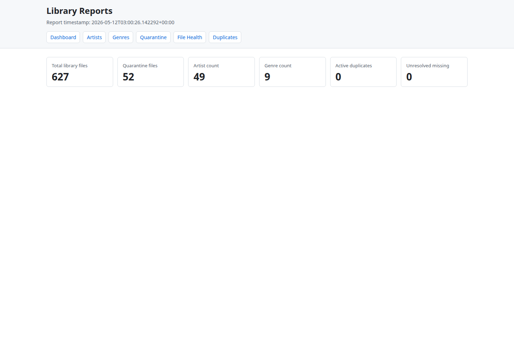

# Media Library Automation Pipeline

A local-first media ingestion, audit, deduplication, quarantine, reporting, and
metadata normalization planning system.

Media Library Automation Pipeline is designed for controlled library operations:
observe files, record evidence, plan changes, review reports, quarantine known
duplicate candidates, and restore from an audit trail. The project is built
around deterministic rules and local SQLite state rather than remote services or
opaque automation.

## 1. Overview

This repository contains a Python application for maintaining a FLAC-focused
local media library. It provides a command-line workflow for scanning and
organizing files, detecting duplicate candidates, producing quality reports,
planning metadata normalization, and safely moving duplicate review outcomes
into quarantine.

The system favors explicit stages. Most commands inspect data and write reports
or ledger records. Commands that can change files are narrow, support dry-run
review where appropriate, and preserve recovery information.

## Documentation

- [Architecture](docs/architecture.md)
- [Operational workflow](docs/operational-workflow.md)
- [Demo workflow](docs/demo-workflow.md)
- [Demo script](docs/demo-script.md)
- [Normalization rules](docs/normalization-rules.md)
- [Sample outputs](docs/sample-outputs/)

## 2. Problem Statement

Personal media libraries often grow through years of inconsistent naming,
partial tags, repeated files, manual folder changes, and uncertain cleanup
history. Once a library reaches hundreds or thousands of files, direct manual
maintenance becomes risky because mistakes can overwrite curated files, remove
the wrong copy, or leave no clear record of what changed.

This project addresses that operational problem by separating observation,
planning, execution, audit, quarantine, and restore into inspectable steps.

## 3. What the System Does

- Scans local audio files and records observations in SQLite.
- Resolves probable track identity from tags, filenames, parent folders, and
  controlled artist seed data.
- Classifies files using deterministic artist and genre rules.
- Plans organized placement paths before copying files.
- Generates library QA, duplicate, metadata audit, and metadata normalization
  reports.
- Produces duplicate review plans and quarantines selected remove candidates.
- Restores quarantined files from recorded ledger information.
- Serves read-only FastAPI/Jinja2 report screens over generated reports.

The project does not claim AI recognition, audio fingerprinting, automatic tag
writing, or unsupervised destructive cleanup.

## 4. Architecture Flow

```text
Local media files
  |
  v
Scanner
  - records file paths, hashes, tags, and probe results
  |
  v
SQLite observation ledger
  |
  +--> Identity engine
  |      - probable artist, title, album, year, and mix
  |      - conflict and unknown states retained for review
  |
  +--> Classification engine
  |      - controlled artist seed rules
  |      - embedded genre metadata fallback
  |
  v
Placement planner
  - creates reviewable destination paths
  - writes plans before file movement
  |
  v
Placement executor
  - copies planned files into an organized library root
  - avoids overwriting existing destinations
  |
  v
QA, duplicate, metadata audit, and metadata plan reports
  |
  v
Duplicate review
  - keep, remove-candidate, and manual-review outcomes
  |
  v
Quarantine and restore
  - ledger-backed movement and recovery
  |
  v
Read-only reporting UI
```

## 5. Current Evidence / Metrics

Current generated evidence shows:

- 627 organised FLAC files
- 52 quarantined duplicates
- 0 active duplicate groups
- 0 unresolved missing files
- 627 readable FLAC files in metadata audit
- 2063 proposed metadata updates
- 232 passing tests

Evidence is represented in generated report artifacts under:

- `reports/library_qa/`
- `reports/duplicates_scan_1/`
- `reports/metadata_audit/`
- `reports/metadata_plan/`

## 6. Core Capabilities

- Local SQLite observation ledger for repeatable file processing.
- Audio scanning for common local media formats, with `ffprobe` results recorded
  when available.
- Identity resolution from available local evidence without remote lookups.
- Deterministic genre and subgenre classification from local rules.
- Placement planning and copy execution for organized library output.
- Library QA summaries for organized files, quarantine state, missing files, and
  duplicate status.
- Duplicate report generation for exact hashes, same artist/title groups, and
  probable variants.
- Duplicate review planning with explicit keep, remove-candidate, and manual
  review outcomes.
- Quarantine movement for selected duplicate remove candidates.
- Restore workflow based on recorded quarantine items.
- FLAC metadata audit and proposed normalization plan generation.
- Read-only web reporting views for generated report data.

## Operational Characteristics

- Deterministic workflows based on local files, local rules, and SQLite records.
- Dry-run support for quarantine and restore review.
- Quarantine instead of deletion for duplicate remediation.
- Restore capability backed by recorded quarantine ledger entries.
- Human approval boundaries between report generation, planning, and execution.
- Audit-first workflow for duplicate, metadata, QA, and remediation decisions.

## 7. CLI Workflow

Initialize the local ledger:

```bash
python -m app.main init-db
```

Scan, identify, classify, and plan placement:

```bash
python -m app.main scan --source ~/Music/Library_Intake
python -m app.main identify --scan-run-id 1
python -m app.main classify --scan-run-id 1
python -m app.main plan-placement --scan-run-id 1
```

Generate core review and QA reports:

Core command forms:

```bash
python -m app.main library-qa ...
python -m app.main metadata-audit ...
python -m app.main metadata-plan ...
python -m app.main duplicate-report ...
python -m app.main duplicate-review ...
python -m app.main quarantine-duplicates --dry-run
python -m app.main restore-quarantine --dry-run
```

Example report commands:

```bash
python -m app.main review-report --scan-run-id 1 --out reports
python -m app.main library-qa \
  --library-root ~/Music/Organised_Library \
  --quarantine-root ~/Music/Quarantine_Duplicates \
  --out reports
python -m app.main metadata-audit \
  --library-root ~/Music/Organised_Library \
  --out reports
python -m app.main metadata-plan \
  --library-root ~/Music/Organised_Library \
  --out reports
python -m app.main duplicate-report \
  --scan-run-id 1 \
  --library-root ~/Music/Organised_Library \
  --out reports
python -m app.main duplicate-review --duplicate-report-id 1 --out reports
```

Run duplicate quarantine and restore in dry-run mode:

```bash
python -m app.main quarantine-duplicates --dry-run
python -m app.main restore-quarantine --dry-run
```

Use a separate SQLite database:

```bash
python -m app.main --db /tmp/media_library.sqlite3 scan --source ~/Music/Library_Intake
```

## 8. Reporting UI

The report UI is a read-only FastAPI/Jinja2 interface over generated reports. It
does not mutate media files, apply duplicate decisions, or write metadata.

Run the UI:

```bash
uvicorn app.main:app --reload
```

Available routes include:

```text
/reports
/reports/artists
/reports/genres
/reports/quarantine
/reports/file-health
/reports/duplicates
/review
/review/quarantine
/review/conflicts
/review/blocked
```

Set `MUSIC_LIBRARY_REPORTS_DIR` before startup to read reports from a directory
other than `reports`.

## Sample Outputs

Sanitized excerpts from generated reports are available under
[docs/sample-outputs/](docs/sample-outputs/):

- [Metadata summary](docs/sample-outputs/sample_metadata_summary.json)
- [Duplicate summary](docs/sample-outputs/sample_duplicate_summary.json)
- [Library QA summary](docs/sample-outputs/sample_library_qa_summary.json)
- [Metadata plan excerpt](docs/sample-outputs/sample_metadata_plan_excerpt.csv)
- [Duplicate review excerpt](docs/sample-outputs/sample_duplicate_review_excerpt.csv)

## Demo Workflow

Use [docs/demo-workflow.md](docs/demo-workflow.md) for the reproducible CLI
walkthrough and [docs/demo-script.md](docs/demo-script.md) for a concise
60-90 second recording script.

## 9. Metadata Audit + Normalization Plan

The metadata audit inspects FLAC files with `mutagen` and reports tag quality
issues without writing changes. The normalization plan proposes updates inferred
from organized library paths and observed metadata.

Current metadata evidence:

- 627 readable FLAC files in metadata audit
- 2063 proposed metadata updates

The plan is intentionally review-oriented. It documents candidate updates; it
does not save tags to media files.

## 10. Duplicate Detection + Quarantine Safety

Duplicate handling is staged:

- `duplicate-report` exports duplicate candidates without changing files.
- `duplicate-review` converts duplicate evidence into reviewable decisions.
- `quarantine-duplicates` moves only rows marked as remove candidates.
- Dry-run mode is available before quarantine execution.

Current duplicate evidence:

- 0 active duplicate groups
- 52 quarantined duplicates

The system distinguishes live duplicate state from historical quarantine state,
so previously quarantined files do not appear as active unresolved duplicate
groups.

## 11. Restore / Recovery Model

Quarantine and restore operations are ledger-backed. The database records source
paths, quarantine paths, run IDs, per-file outcomes, and restore attempts.

Restore uses recorded quarantine items instead of guessing from the filesystem.
It supports dry-run mode and avoids overwriting existing restore targets.

## 12. Testing

The test suite covers scanner behavior, identity resolution, classification,
intake, placement planning and execution, reporting, duplicate review,
quarantine, restore, metadata audit, metadata planning, and report UI behavior.

Run tests:

```bash
python -m pytest -q
```

Current result:

```text
232 passed
```

## 13. Repository Structure

```text
app/
  main.py                 CLI entry point and report UI app
  scanner.py              Local media observation
  identity_engine.py      Deterministic identity resolution
  classifier.py           Classification rules
  placement.py            Placement planning and execution
  duplicate_*.py          Duplicate reporting, review, quarantine, restore
  metadata_*.py           FLAC audit and normalization planning
  report_*.py             Report generation and UI helpers

reports/
  library_qa/             Library health reports
  duplicates_scan_1/      Duplicate report outputs
  metadata_audit/         Metadata audit outputs
  metadata_plan/          Metadata normalization plan outputs

tests/
  test_*.py               Focused pytest coverage for pipeline behavior

docs/
  screenshots/            Portfolio screenshot targets
```

## 14. Screenshots

Screenshot placeholders:




## 15. Roadmap

- Add real UI screenshots for the documented report and review screens.
- Add a scripted demo dataset so portfolio metrics can be regenerated
  reproducibly.
- Expand command documentation with input and output contracts.
- Add portable report bundles that avoid exposing local absolute paths.
- Improve metadata plan review workflow while keeping tag writing separate from
  audit and planning.
- Add more failure-mode tests for interrupted quarantine and restore boundary
  validation.
