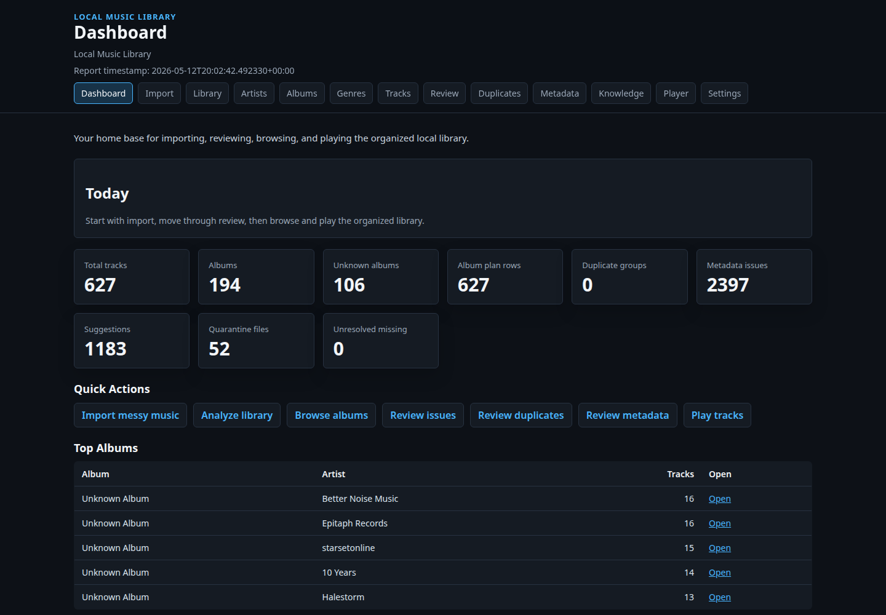
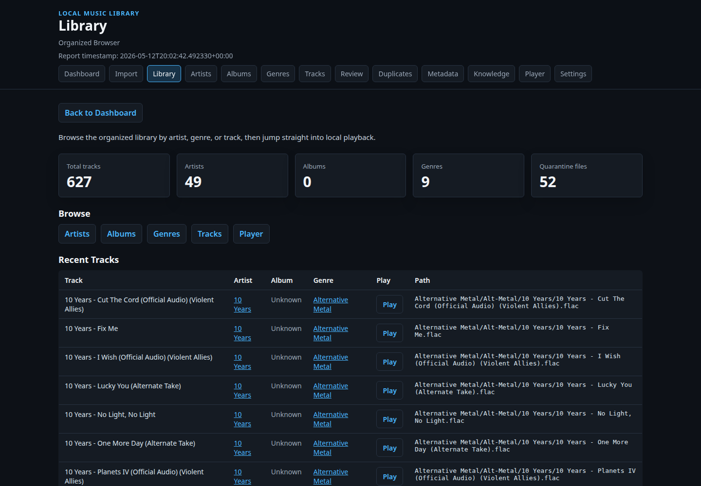
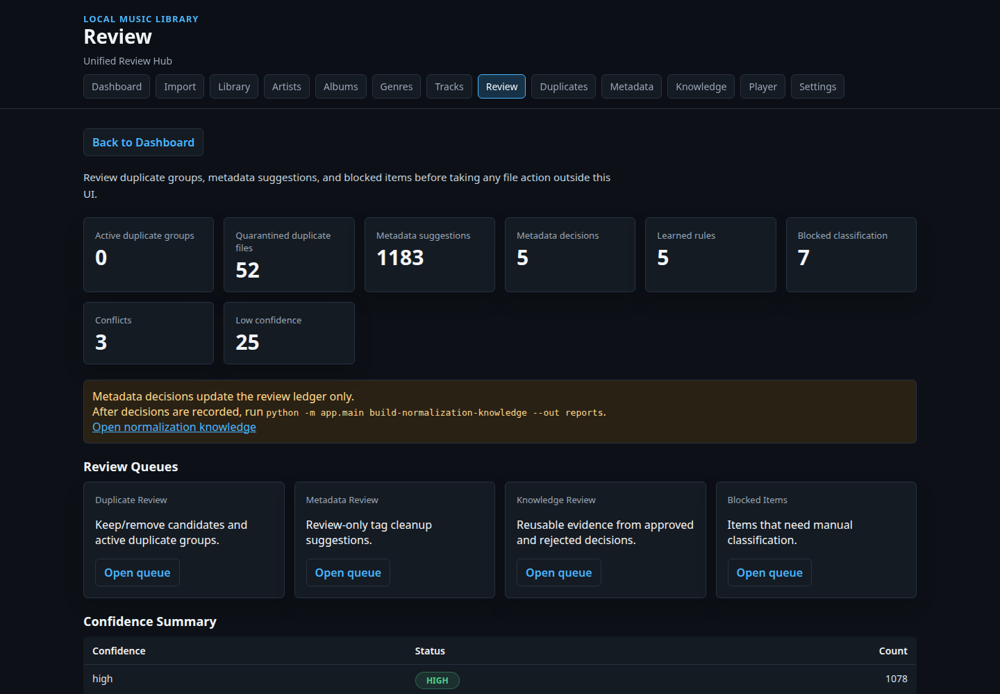
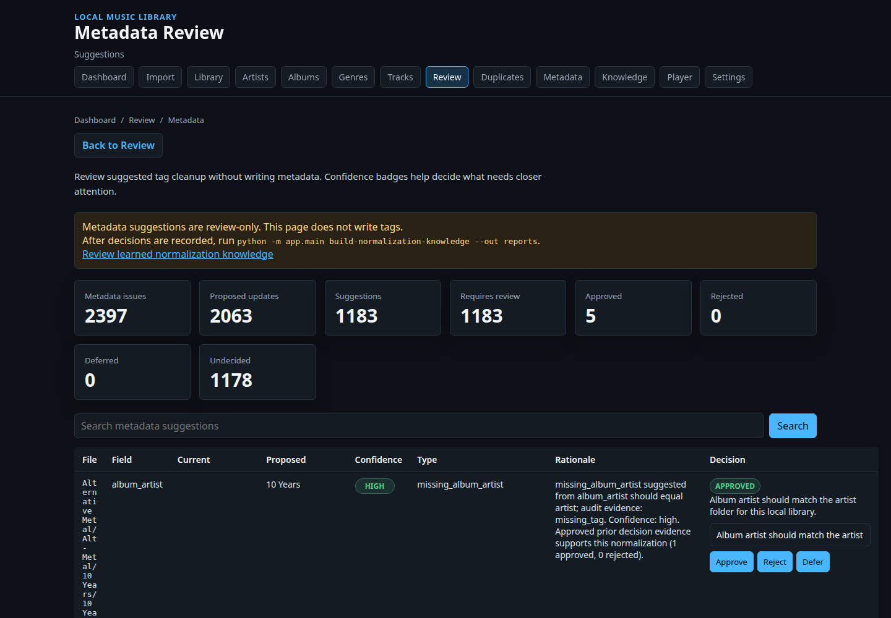
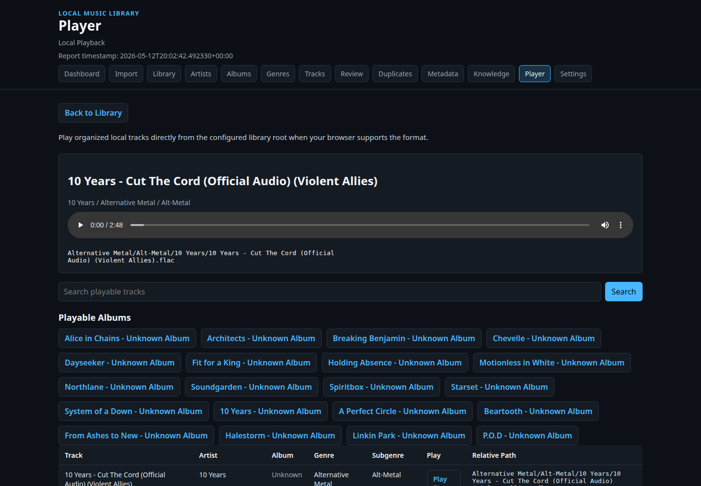

# Music Library Intelligence Platform

Music Library Intelligence Platform is a local-first system for understanding,
normalizing, and safely remediating user-owned or legally sourced music
libraries.

The platform organizes evidence around Artists -> Albums -> Tracks without
cloud accounts, AI/LLM enrichment, media acquisition, or destructive automation. It
observes local files, normalizes metadata evidence, detects duplicates, scores
confidence, proposes evidence-based remediation, keeps audit logs, and routes
uncertain decisions through human review. External metadata validation is
metadata-only and remains separate from the local canonical graph.

It is a metadata intelligence and remediation governance platform, not a
playback-first app, AI wrapper, or automatic tag writer. Optional metadata-only
acquisition commands exist for supported sources, but they do not acquire audio
or media, do not enrich the canonical graph remotely, and do not mutate local
library state.

## 1. Overview

This repository contains a Python application and server-rendered Jinja2 UI for
maintaining a FLAC-focused local music library intelligence workflow. The
primary workflow is:

```text
Import messy music
  -> analyze library
  -> review issues
  -> review duplicates
  -> review metadata suggestions
  -> browse organized artists, albums, and tracks
  -> optionally preview local tracks
```

The command-line pipeline still performs the deterministic scanning, planning,
QA, duplicate, metadata, quarantine, and restore work. The UI consolidates those
outputs into one coherent local music library application.

The system favors explicit stages: observation, planning, review, execution,
quarantine, and restore. Most commands inspect data and write reports or ledger
records. Commands that can change files are narrow, support dry-run review where
appropriate, and preserve recovery information.

## Documentation

- [Architecture](docs/architecture.md)
- [Operational workflow](docs/operational-workflow.md)
- [Metadata suggestion workflow](docs/metadata-suggestion-workflow.md)
- [Portfolio demo workflow](tools/portfolio_demo/docs/demo-workflow.md)
- [Portfolio demo script](tools/portfolio_demo/docs/demo-script.md)
- [Normalization rules](docs/normalization-rules.md)
- [Evidence reliability](docs/evidence-reliability.md)
- [Canonical entity graph](docs/canonical-entity-graph.md)
- [Canonical entity classification](docs/canonical-entity-classification.md)
- [Canonical confidence](docs/canonical-confidence.md)
- [Promotion lifecycle](docs/promotion-lifecycle.md)
- [Conflict resolution governance](docs/conflict-governance.md)
- [Entity boundary classifier](docs/entity-boundaries.md)
- [Entity roles](docs/entity-roles.md)
- [External metadata ingestion](docs/external-metadata-ingestion.md)
- [MusicBrainz dump conversion](docs/musicbrainz-conversion.md)
- [Large-scale evidence validation](docs/large-scale-evidence-validation.md)
- [Validation benchmarking](docs/validation-benchmarking.md)
- [Validation results](docs/validation-results/)
- [Sample outputs](docs/sample-outputs/)

## Validation Evidence

- [Cross-source validation summary](docs/validation-results/cross-source-validation-summary.md)
- [MusicBrainz 50k consolidated result](docs/validation-results/musicbrainz-50k-consolidated-result.md)
- Reproducible public fixture: reviewers can run a metadata-only fixture
  workflow from [docs/public-fixture-validation.md](docs/public-fixture-validation.md).
  It uses fictional CSV metadata only: no audio, no private data, no external API
  credentials, and no media downloads.
- Public validation evidence is committed as summarized documentation under
  [docs/validation-results/](docs/validation-results/).
- Full generated run artifacts are local ignored report outputs. A representative
  local ignored isolated run path is `reports/runs/musicbrainz/musicbrainz_50k/`, but
  `reports/` is ignored and is not expected to be present in the public
  repository.
- Manifest guarantees: `metadata_only=true`, `audio_downloaded=false`, `local_library_mutated=false`, `canonical_graph_mutated=false`.
- 50,000 MusicBrainz metadata rows processed; 49,773 accepted after conversion.
- 49,773 ingested records; 0 rejected records; 0 missing artist, album, or title fields.
- Release identity analysis explained 13,712 duplicate-looking external records; integrated benchmark `duplicate_external_records=0`.
- Integrated benchmark reports 1,212 cohorts and 1,212 conflicts after artist-credit and release-identity analysis.
- Jamendo 100 metadata-only smoke validated with redacted media URLs.
- [Jamendo 10k metadata-only validation](docs/validation-results/jamendo-10k-validation.md)
  completed for a second live metadata source: 10,000 fetched, 10,000 accepted,
  0 rejected, 0 duplicate external records, and 205 integrated benchmark
  conflicts.

## Setup

Create a virtual environment and install the Python dependencies:

```bash
python3 -m venv .venv
source .venv/bin/activate
python -m pip install --upgrade pip
python -m pip install -r requirements.txt
```

Run the test suite:

```bash
python -m pytest -q
```

Example metadata-only validation command:

```bash
python -m app.main benchmark-validation --source local_fixture --out reports
```

Generated reports and local data are ignored by git. Large metadata dumps and
working data should live outside the repository by setting
`MUSIC_INTELLIGENCE_DATA_ROOT`; see
[docs/external-data-root.md](docs/external-data-root.md).

## 2. Problem Statement

Personal media libraries often grow through years of inconsistent naming,
partial tags, repeated files, manual folder changes, and uncertain cleanup
history. Once a library reaches hundreds or thousands of files, direct manual
maintenance becomes risky because mistakes can overwrite curated files, remove
the wrong copy, or leave no clear record of what changed.

This project addresses that operational problem by separating observation,
planning, execution, audit, quarantine, and restore into inspectable steps with
evidence preserved at each review boundary.

## 3. What the System Does

- Scans local audio files and records observations in SQLite.
- Resolves probable track identity from tags, filenames, parent folders, and
  controlled artist seed data.
- Infers album groupings from FLAC album tags, album-like parent folders,
  filename/title evidence, or the explicit `Unknown Album` fallback.
- Generates album cohesion reports that score album groupings from repeated
  agreement across tags, track numbers, years, folders, filenames, co-occurrence,
  placement structure, and normalization knowledge evidence when present.
- Generates evidence reliability reports that score metadata evidence before
  album cohesion and metadata suggestions rely on it.
- Uses a canonical entity type classifier that blocks track titles, source
  artifacts, uploader channels, and ambiguous strings before graph promotion.
- Maintains a canonical entity graph that persists canonical artists, albums, tracks,
  versions, and evidence-governed relationships without auto-merging conflicts.
- Applies conflict resolution governance that classifies unresolved canonical graph
  conflicts into blocked merges, safe merge candidates, and review queues
  without executing merges.
- Classifies files using deterministic artist and genre rules.
- Plans album-aware organized placement paths before copying files.
- Generates library QA, duplicate, metadata audit, metadata normalization, and
  metadata suggestion reports for evidence-based remediation proposals.
- Detects likely album conflicts, probable singles, compilation mixes, and
  orphan tracks without auto-assigning album tags.
- Produces duplicate review plans and quarantines selected remove candidates.
- Restores quarantined files from recorded ledger information.
- Serves a read-only FastAPI/Jinja2 local music library UI over generated
  reports, with album-aware browsing from existing album folders, generated
  album organization plans, or fallback grouping when tracks have no album
  folder yet.
- Plays organized local tracks through an HTML5 audio player when the browser
  supports the file format.

The project does not claim AI recognition, audio fingerprinting, automatic tag
writing, or unsupervised destructive cleanup.

## 4. Architecture Flow

```text
Local media files
  |
  v
Scanner
  - records file paths, hashes, tags, and probe results
  |
  v
SQLite observation ledger
  |
  +--> Identity engine
  |      - probable artist, title, album, year, and mix
  |      - conflict and unknown states retained for review
  |
  +--> Classification engine
  |      - controlled artist seed rules
  |      - embedded genre metadata fallback
  |
  v
Placement planner
  - creates reviewable Genre / Artist / Album / Track destination paths
  - writes plans before file movement
  |
  v
Placement executor
  - copies planned files into an organized library root
  - avoids overwriting existing destinations
  |
  v
QA, duplicate, metadata audit, and metadata plan reports
  |
  v
Metadata suggestions
  - review-only cleanup suggestions from audit and plan evidence
  - local deterministic rationale and confidence scoring
  |
  v
Review decision ledger
  - approved, rejected, and deferred human decisions
  - audit trail for future reusable normalization rules
  |
  v
Normalization knowledge engine
  - reusable evidence from approved and rejected decisions
  - improves future suggestion confidence without auto-approval
  |
  v
Evidence reliability engine
  - detects uploader/channel artifacts, platform remnants, noisy imports, and
    canonical agreement
  - down-ranks unreliable evidence for album cohesion and suggestions
  |
  v
Duplicate review
  - keep, remove-candidate, and manual-review outcomes
  |
  v
Quarantine and restore
  - ledger-backed movement and recovery
  |
  v
Local music library app UI
```

## 5. Current Evidence / Metrics

Repository-safe evidence includes:

- 585 passing tests
- MusicBrainz 50k validation summary committed under
  [docs/validation-results/](docs/validation-results/)
- Sanitized sample outputs committed under
  [docs/sample-outputs/](docs/sample-outputs/)
- Golden regression fixtures under [tests/golden_cases/](tests/golden_cases/)
- Metadata-only external validation workflow with ignored local run artifacts

The public repository commits source code, tests, documentation, sample
outputs, and summarized validation results. Generated `reports/`, `data/`,
demo exports, SQLite databases, and caches are local runtime artifacts.

## 6. Core Capabilities

- Local SQLite observation ledger for repeatable file processing.
- Audio scanning for common local media formats, with `ffprobe` results recorded
  when available.
- Identity resolution from available local evidence without remote lookups.
- Deterministic genre and subgenre classification from local rules.
- Placement planning and copy execution for organized library output.
- Plan-first album organization for existing libraries; the
  `plan-album-organization` command writes CSV/JSON reports and never moves
  files.
- Library QA summaries for organized files, quarantine state, missing files, and
  duplicate status.
- Duplicate report generation for exact hashes, same artist/title groups, and
  probable variants.
- Duplicate review planning with explicit keep, remove-candidate, and manual
  review outcomes.
- Quarantine movement for selected duplicate remove candidates.
- Restore workflow based on recorded quarantine items.
- FLAC metadata audit and proposed normalization plan generation.
- Review-only metadata cleanup suggestions generated from audit and plan
  evidence.
- Review-only album metadata discovery for tracks currently missing album tags
  or grouped as `Unknown Album`.
- Unified read-only web UI for import workflow, dashboard, library browsing,
  review queues, inspection-only local file preview, and settings.
- Metadata-only external source ingestion from local CSV/JSONL fixtures for
  future validation reports, kept separate from the local library and canonical
  graph.
- Metadata-only MusicBrainz dump conversion from local extracted tables into
  the external metadata ingestion contract.
- Read-only large-scale external metadata validation that groups evidence
  problems into cohorts before any reviewed canonical comparison work.
- Read-only artist-credit parsing analysis that separates primary, featured,
  collaboration, and unresolved external artist-credit strings without changing
  canonical graph entities.

## Operational Characteristics

- Deterministic workflows based on local files, local rules, and SQLite records.
- Dry-run support for quarantine and restore review.
- Quarantine instead of deletion for duplicate remediation.
- Restore capability backed by recorded quarantine ledger entries.
- Human approval boundaries between report generation, planning, and execution.
- Audit-first workflow for duplicate, metadata, QA, and remediation decisions.
- Review checkpoints before file movement or recovery operations.

## Review Decision Ledger

Review decisions are persisted as an audit ledger for metadata suggestions.
Approved, rejected, and deferred decisions do not write tags, move files, or
approve future actions automatically. The ledger will later feed reusable
normalization rules for artist casing, title cleanup, album artist handling, and
rejected cleanup patterns.

## Normalization Knowledge Engine

The normalization knowledge engine derives reusable rules from the review
decision ledger. Approved decisions become future evidence for matching metadata
suggestions, and rejected decisions are retained as rejected patterns. Knowledge
can improve suggestion confidence and rationale, but it never writes metadata
tags, moves files, deletes files, or auto-approves suggestions.

## 7. CLI Workflow

Initialize the local ledger:

```bash
python -m app.main init-db
```

Scan, identify, classify, and plan placement:

```bash
python -m app.main scan --source ~/Music/Library_Intake
python -m app.main identify --scan-run-id 1
python -m app.main classify --scan-run-id 1
python -m app.main plan-placement --scan-run-id 1
```

Generate core review and QA reports:

Core command forms:

```bash
python -m app.main library-qa ...
python -m app.main metadata-audit ...
python -m app.main metadata-plan ...
python -m app.main metadata-suggestions ...
python -m app.main review-decision ...
python -m app.main import-review-decisions ...
python -m app.main review-decision-report --out reports
python -m app.main build-normalization-knowledge --out reports
python -m app.main album-cohesion --out reports
python -m app.main evidence-reliability --out reports
python -m app.main canonical-graph --out reports
python -m app.main plan-metadata-acquisition --source musicbrainz --out reports
python -m app.main convert-musicbrainz-dump --dump-dir ... --out ... --limit 10000
python -m app.main fetch-jamendo-metadata --limit 1000 --out reports
python -m app.main fetch-internet-archive-metadata --query "collection:audio" --limit 10000 --out reports
python -m app.main benchmark-validation --source local_fixture --out reports
python -m app.main discover-albums ...
python -m app.main duplicate-report ...
python -m app.main duplicate-review ...
python -m app.main quarantine-duplicates --dry-run
python -m app.main restore-quarantine --dry-run
```

Large external metadata storage is configurable with
`MUSIC_INTELLIGENCE_DATA_ROOT`. Use an external SSD for real metadata dumps; see
[docs/external-data-root.md](docs/external-data-root.md). Metadata acquisition
planning is report-only in v1: it targets external raw dump, metadata, and cache
directories, but it does not live-fetch data or download audio. See
[docs/metadata-acquisition-planning.md](docs/metadata-acquisition-planning.md).
Internet Archive acquisition is available as a metadata-only validation input:
it fetches search metadata records only, never media files. See
[docs/internet-archive-metadata.md](docs/internet-archive-metadata.md).
Jamendo acquisition is also metadata-only: it fetches catalog JSON records for
external validation, prints one progress line per fetched page during live
acquisition, and never downloads or streams audio. See
[docs/jamendo-metadata.md](docs/jamendo-metadata.md).

Example report commands:

```bash
python -m app.main review-report --scan-run-id 1 --out reports
python -m app.main library-qa \
  --library-root ~/Music/Organised_Library \
  --quarantine-root ~/Music/Quarantine_Duplicates \
  --out reports
python -m app.main metadata-audit \
  --library-root ~/Music/Organised_Library \
  --out reports
python -m app.main metadata-plan \
  --library-root ~/Music/Organised_Library \
  --out reports
python -m app.main metadata-suggestions \
  --metadata-plan reports/metadata_plan/metadata_plan.csv \
  --metadata-audit reports/metadata_audit \
  --out reports
python -m app.main review-decision \
  --suggestion-key <key> \
  --decision approved \
  --reason "confirmed by review"
python -m app.main import-review-decisions \
  --suggestions reports/metadata_suggestions/metadata_suggestions.csv \
  --decisions decisions.csv
python -m app.main review-decision-report --out reports
python -m app.main build-normalization-knowledge --out reports
python -m app.main album-cohesion --out reports
python -m app.main evidence-reliability --out reports
python -m app.main canonical-graph --out reports
python -m app.main plan-album-organization \
  --library-root ~/Music/Organised_Library \
  --out reports
python -m app.main discover-albums \
  --library-root ~/Music/Organised_Library \
  --out reports
python -m app.main duplicate-report \
  --scan-run-id 1 \
  --library-root ~/Music/Organised_Library \
  --out reports
python -m app.main duplicate-review --duplicate-report-id 1 --out reports
```

Bulk decision imports can identify suggestions by `suggestion_key` or by the visible suggestion fields: `file_path`, `field`, `current_value`, `proposed_value`, and optionally `suggestion_type`.

Album-aware organization is plan-first. The generated report lives under
`reports/album_organization_plan/` and proposes paths in this shape:

```text
Genre/
  Artist/
    Album/
      Artist - Track.flac
```

`plan-album-organization` does not move, delete, copy, or write metadata tags.
It exists to make album folders reviewable before any future migration step, and
to prepare the UI for proper artist -> album -> track browsing.

Album Cohesion Engine reports are also review-only. The `album-cohesion`
command looks for repeated evidence agreement instead of trusting one field:
album tags, sequential track numbers, shared years, repeated source folders,
filename patterns, track co-occurrence, directory structure, placement
structure, and normalization knowledge references in metadata suggestions when
available. It writes reports under `reports/album_cohesion/`:

```text
album_cohesion_summary.json
album_groups.json
album_groups.csv
album_conflicts.csv
orphan_tracks.csv
```

The report includes `cohesion_score`, `high` / `medium` / `low` confidence
tiers, rationale snippets, probable singles, probable compilation mixes,
conflicting album assignments, and orphan tracks. It does not write metadata
tags, move files, create album folders, or auto-approve assignments.

Evidence Reliability Engine reports are review-only. The
`evidence-reliability` command scores metadata evidence quality from existing
metadata suggestions, album cohesion output, normalization knowledge, and review
decisions. It writes reports under `reports/evidence_reliability/`:

```text
evidence_reliability_summary.json
unreliable_evidence.csv
reliable_patterns.csv
reliability_groups.json
```

Reliability records include a `reliability_score` from 0.0 to 1.0, a `high` /
`medium` / `low` tier, flags, and rationale snippets. The engine detects
uploader/channel signatures, official media suffixes, remaster noise, platform
branding, noisy autogenerated names, casing anomalies, excessive separators,
artist/folder mismatches, and repeated non-musical tokens. It raises reliability
when repeated canonical agreement, normalization knowledge, album cohesion,
sequential tracks, folder consistency, prior approvals, or low conflict rates
support the value. It never mutates media files or removes metadata.

Canonical Entity Classification reports are review-only. The
`classify-canonical-entities` command classifies candidate artist, album, and
track strings before the graph can promote them:

```text
reports/canonical_entity_classification/
  entity_classification_summary.json
  entity_classifications.csv
  blocked_entity_candidates.csv
  ambiguous_entity_candidates.csv
```

The classifier flags track titles misfiled as artists, uploader/channel
artifacts, source or label residue, version descriptors, valid canonical
candidates, and unresolved ambiguity. The canonical graph uses the same
deterministic classifications to keep blocked artist and album candidates out
of active canonical entities while retaining the rationale as unresolved
conflict evidence. It never mutates media files or writes metadata.

Entity Role reports are review-only. The `entity-roles` command separates
`entity_value` from `entity_value + entity_role + context`, so legitimate
multi-role values such as artist names that also appear as album titles are not
blocked globally:

```text
reports/entity_roles/
  entity_role_summary.json
  entity_roles.csv
  multi_role_entities.csv
  conflicted_roles.csv
  blocked_role_collisions.csv
```

The classifier and canonical graph use role context to preserve valid
multi-role artists, albums, and tracks while keeping source-artifact and
uploader-artifact blocking role-specific. It never mutates media files or
writes metadata.

Canonical Confidence reports are review-only. The `canonical-confidence`
command scores canonical entity evidence with deterministic positive and
negative weights, then normalizes the score into high, medium, low, or blocked
confidence:

```text
reports/canonical_confidence/
  confidence_summary.json
  scored_entities.csv
  high_confidence_entities.csv
  blocked_entities.csv
  confidence_breakdowns.json
```

The weighted engine explains each score with positive evidence, negative
evidence, raw totals, normalized confidence, and rationale. It has no AI,
embedding, vector database, or external API dependency, and it never mutates
media files or writes metadata.

Promotion Lifecycle reports are review-only. The `promotion-lifecycle` command
turns confidence snapshots, temporal persistence, and graph context into
deterministic lifecycle states:

```text
reports/promotion_lifecycle/
  lifecycle_summary.json
  lifecycle_entities.csv
  canonical_entities.csv
  probationary_entities.csv
  conflicted_entities.csv
  deprecated_entities.csv
```

Lifecycle states include candidate, probationary, canonical, conflicted,
blocked, and deprecated. Promotion is reversible, so high confidence with short
history remains probationary, long-lived stable evidence can become canonical,
and previously promoted entities can be deprecated if confidence collapses. It
never mutates media files or writes metadata.

Canonical Entity Graph reports are review-only and persistent. The
`canonical-graph` command rebuilds canonical artists, albums, tracks, versions,
and relationships from accumulated local evidence, then writes:

```text
reports/canonical_graph/
  canonical_artists.csv
  canonical_albums.csv
  canonical_tracks.csv
  canonical_versions.csv
  entity_relationships.csv
  unresolved_conflicts.csv
  graph_summary.json
```

The graph supports `alias_of`, `belongs_to_album`, `probable_duplicate`,
`probable_live_version`, `probable_remaster`, `probable_single`,
`probable_compilation_member`, and `probable_same_track` relationships. It
records unresolved ambiguity instead of silently collapsing conflicting
entities, and it never writes tags, moves files, deletes files, calls external
APIs, or uses embeddings.

Conflict governance includes deterministic artist alias equivalence for safe
casing and punctuation variants such as `Tool` -> `TOOL` or `System of a Down`
-> `System Of A Down`, plus deterministic album-title punctuation equivalence
for album membership conflicts such as `Shallow Bay The Best Of Breaking
Benjamin` -> `Shallow Bay: The Best Of Breaking Benjamin`. These rows are only
`safe_to_merge_candidate` review items in
`reports/conflict_governance/safe_merge_candidates.csv`; they are not
auto-merged and still require the reviewed canonical alias or album workflow.
Role collisions, collaboration strings, official audio/video/version suffixes,
semantic album edition/remaster/live/acoustic/deluxe differences, weak album
cohesion, uploader or channel artifacts, blocked lifecycle states, and dominant
artifact evidence remain protected.

The `alias-equivalence-audit` command instruments artist alias and album-title
equivalence without changing governance decisions:

```bash
python -m app.main alias-equivalence-audit --out reports
```

It writes `reports/alias_equivalence_audit/` with the full audit, prevented
escalations, missed safe aliases, remaining escalations, and summary counts.

Entity Boundary Classifier runs before role assignment and graph insertion to
keep deterministic title, source, uploader, label, release annotation, and
collaboration pollution out of canonical artist and album space:

```bash
python -m app.main entity-boundaries --out reports
```

It writes `reports/entity_boundaries/` and remains review-only.

Artist Credit Parsing v1 analyzes the collaboration-string validation cohort
without changing canonical entities:

```bash
python -m app.main analyze-artist-credits --source musicbrainz --out reports
```

It writes `reports/artist_credit_analysis/` with parsed primary artists,
featured artists, collaborators, unresolved credits, pattern counts, and top
collaborators. The output prepares future canonical graph integration but does
not auto-merge artists or create canonical aliases in v1.

When those reports exist for the same source, `benchmark-validation` consumes
the artist-credit summary and parsed rows as reporting evidence. Raw
`collaboration_string` benchmark failures are separated into parser-explained
high-confidence credits, medium-confidence collaborations, featured artists,
ambiguous group names, and unresolved artist credits. This does not mutate
source metadata, local files, tags, canonical graph behavior, or artist merge
behavior.

Major validation commands can be grouped into isolated report runs with
`--run-label`:

```bash
python -m app.main analyze-artist-credits --source musicbrainz --out reports --run-label musicbrainz_50k
python -m app.main analyze-release-identity --source musicbrainz --out reports --run-label musicbrainz_50k
python -m app.main benchmark-validation --source musicbrainz --out reports --run-label musicbrainz_50k
```

Labeled output is written below
`reports/runs/{source}/{run_label}/` with a `run_manifest.json`. Use those
isolated paths for committed validation evidence; unlabeled smoke tests keep
the historical overwrite-friendly report paths.

Release-Aware Identity Analysis v1 investigates duplicate-looking external
metadata rows without treating MusicBrainz release appearances as removable
duplicates:

```bash
python -m app.main analyze-release-identity --source musicbrainz --out reports
```

It writes `reports/release_identity_analysis/` with identity groups, release
appearances, possible true duplicates, legitimate release appearances, and
ambiguous identity groups. This is reporting-only and does not alter duplicate
quarantine behavior, canonical graph state, local files, tags, or source
metadata.

When those reports exist for the same source, `benchmark-validation` consumes
the release identity summary and identity groups as reporting evidence. Raw
`duplicate_external_record` benchmark failures are separated into legitimate
release appearances, edition/reissue clusters, compilation or multi-release
appearances, possible true duplicates, ambiguous identity groups, and
unresolved duplicate-like records. Duplicate-looking external metadata rows are
not removable duplicates by default.

Album metadata discovery is also review-only. The `discover-albums` command
looks at existing tags, filenames, and local path evidence for tracks with
missing or `Unknown Album` album values, then writes suggestions under
`reports/album_discovery/`:

```text
album_discovery_summary.json
album_discovery_suggestions.csv
album_discovery_suggestions.json
```

Album discovery is local-only in v1. It uses deterministic local evidence and
does not perform remote lookups, write tags, move files, rename files, or
auto-approve album matches. Every suggestion is marked as requiring human
review, and suggestions must be reviewed before any future execution workflow.

Run duplicate quarantine and restore in dry-run mode:

```bash
python -m app.main quarantine-duplicates --dry-run
python -m app.main restore-quarantine --dry-run
```

Use a separate SQLite database:

```bash
python -m app.main --db /tmp/media_library.sqlite3 scan --source ~/Music/Library_Intake
```

## 8. Music Library Intelligence UI

The UI is a read-only FastAPI/Jinja2 local application over generated pipeline
reports. It does not mutate media files, apply duplicate decisions, write
metadata, authenticate users, call remote APIs, or acquire media.

Run the UI:

```bash
uvicorn app.main:app --reload
```

Available routes include:

```text
/
/import
/library
/library/artists
/library/albums
/library/albums/{album_key}
/library/genres
/library/tracks
/review
/review/duplicates
/review/metadata
/review/canonical-graph
/review/entity-classification
/review/entity-roles
/review/reliability
/player
/settings
```

Legacy report/review URLs remain available for compatibility, including
`/reports`, `/reports/duplicates`, `/review/quarantine`, `/review/conflicts`,
`/review/blocked`, and `/review/metadata-suggestions`.

The metadata review pages show proposed values, confidence, rationale, and
source evidence without writing tags or modifying media files. Metadata
suggestions can be approved, rejected, or deferred from the UI. These decisions
update the review ledger and can later be converted into reusable normalization
knowledge with `python -m app.main build-normalization-knowledge --out reports`.

Local preview is supported only for inspecting user-owned files in the configured
library. Audio is served through
`/media/audio?path=<relative_library_path>`, and the server restricts preview to
files that resolve inside the configured library root. This is a supporting
inspection aid; the core product remains metadata intelligence and remediation
governance.

Set `MUSIC_LIBRARY_REPORTS_DIR` before startup to read reports from a directory
other than `reports`.

## Portfolio Demo Tooling

Portfolio and demo tooling is isolated under `tools/portfolio_demo/` so the
core application remains focused on library intelligence workflows. The legacy
CLI commands below still work as compatibility entry points.

### UI Screenshot Capture

With the project virtual environment active, install the Python dependencies,
then install the Playwright Chromium browser:

```bash
python -m pip install -r requirements.txt
playwright install chromium
```

With the local UI already running at `http://127.0.0.1:8000`, capture
deterministic portfolio screenshots:

```bash
python -m app.main capture-ui-screenshots
```

Screenshots are written to `tools/portfolio_demo/docs/screenshots/` using stable
filenames for the dashboard, library browser, unified review hub, metadata
review, and player views. The command prints `captured=<count>`,
`failed=<count>`, and each generated file path; individual route failures are
reported without stopping remaining captures.

### Demo Generation

Generate deterministic local demo artifacts from UI screenshots and read-only
CLI evidence frames:

```bash
python -m app.main generate-demo
```

Dependencies: Python requirements, Playwright Chromium for UI screenshots, and
optional `ffmpeg` for MP4 stitching. Compatibility outputs are written to the
ignored local `demo/` path: `demo/frames/`, `demo/demo_script.md`,
`demo/demo_manifest.json`, and `demo/demo.mp4` when `ffmpeg` is installed. The
portfolio tooling itself is isolated under `tools/portfolio_demo/`; the ignored
local `demo/` directory is generated evidence, not a committed core product
output. This workflow does not perform live screen recording, voice synthesis, AI
narration, schema changes, or media-file mutation. Demo assets are regenerated
from current report and review workflows each run.

## Sample Outputs

Sanitized excerpts from generated reports are available under
[docs/sample-outputs/](docs/sample-outputs/):

- [Metadata summary](docs/sample-outputs/sample_metadata_summary.json)
- [Duplicate summary](docs/sample-outputs/sample_duplicate_summary.json)
- [Library QA summary](docs/sample-outputs/sample_library_qa_summary.json)
- [Metadata plan excerpt](docs/sample-outputs/sample_metadata_plan_excerpt.csv)
- [Duplicate review excerpt](docs/sample-outputs/sample_duplicate_review_excerpt.csv)

## Demo Workflow

Use [tools/portfolio_demo/docs/demo-workflow.md](tools/portfolio_demo/docs/demo-workflow.md)
for the reproducible CLI walkthrough and
[tools/portfolio_demo/docs/demo-script.md](tools/portfolio_demo/docs/demo-script.md)
for a concise 60-90 second recording script.

## 9. Metadata Audit + Normalization Plan

The metadata audit inspects FLAC files with `mutagen` and reports tag quality
issues without writing changes. The normalization plan proposes updates inferred
from organized library paths and observed metadata.

Metadata plan evidence is intentionally review-oriented. It documents candidate
updates from local audit inputs; it does not save tags to media files. Public
examples use sanitized sample outputs and golden regression fixtures rather than
private local library counts.

## 10. Duplicate Detection + Quarantine Safety

Duplicate handling is staged:

- `duplicate-report` exports duplicate candidates without changing files.
- `duplicate-review` converts duplicate evidence into reviewable decisions.
- `quarantine-duplicates` moves only rows marked as remove candidates.
- Dry-run mode is available before quarantine execution.

Duplicate reports distinguish active duplicate state from historical quarantine
state, so previously quarantined files do not appear as active unresolved
duplicate groups. Public examples use sanitized sample outputs rather than
private local quarantine counts.

## 11. Restore / Recovery Model

Quarantine and restore operations are ledger-backed. The database records source
paths, quarantine paths, run IDs, per-file outcomes, and restore attempts.

Restore uses recorded quarantine items instead of guessing from the filesystem.
It supports dry-run mode and avoids overwriting existing restore targets.

## 12. Testing

The test suite covers scanner behavior, identity resolution, classification,
intake, placement planning and execution, reporting, duplicate review,
quarantine, restore, metadata audit, metadata planning, and report UI behavior.

Run tests:

```bash
python -m pytest -q
```

Current result:

```text
585 passed
```

## 13. Repository Structure

```text
app/
  main.py                 CLI entry point and local UI app
  scanner.py              Local media observation
  identity_engine.py      Deterministic identity resolution
  classifier.py           Classification rules
  placement_planner.py    Reviewable destination path planning
  placement_executor.py   Controlled copy execution from approved plans
  duplicate_*.py          Duplicate reporting, review, quarantine, restore
  album_cohesion.py       Repeated-evidence album grouping reports
  metadata_*.py           FLAC audit and normalization planning
  library_app_ui.py       Unified local music library UI routes
  report_*.py             Report generation and compatibility UI helpers

tests/
  test_*.py               Focused pytest coverage for pipeline behavior

docs/
  validation-results/     Committed summarized validation evidence
  sample-outputs/         Sanitized report excerpts

tools/portfolio_demo/
  demo_generator.py       Portfolio/demo frame generation
  ui_screenshot_capture.py Screenshot capture helper
  docs/                   Demo workflow, script, and screenshots
```

Generated report directories such as `reports/library_qa/`,
`reports/metadata_audit/`, and `reports/runs/musicbrainz/musicbrainz_50k/`
are local runtime outputs and are ignored by git. Public validation evidence is
committed as summarized documentation under `docs/validation-results/`.

## 14. Screenshots

| Dashboard | Library | Review |
| --- | --- | --- |
| <br><sub>Dashboard</sub> | <br><sub>Library browser</sub> | <br><sub>Review hub</sub> |
| <br><sub>Metadata review</sub> | <br><sub>Player</sub> |  |

## 15. Public Repository Hygiene

Generated reports, local data roots, demo exports, SQLite databases, caches, and
large metadata dumps are intentionally ignored. Public review should evaluate
the tracked source code, tests, documentation, sanitized sample outputs, and
summarized validation evidence under `docs/validation-results/`.
